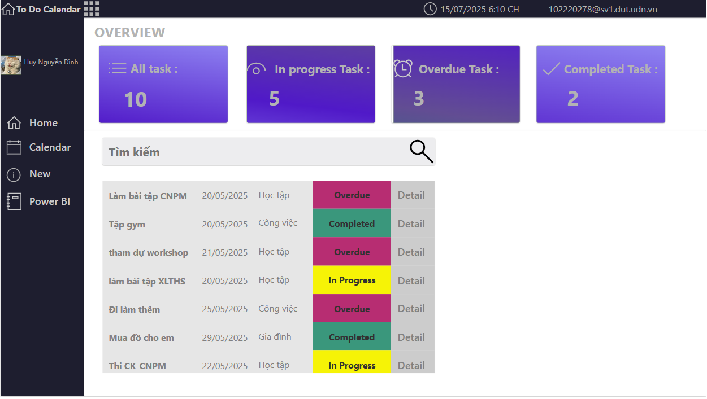
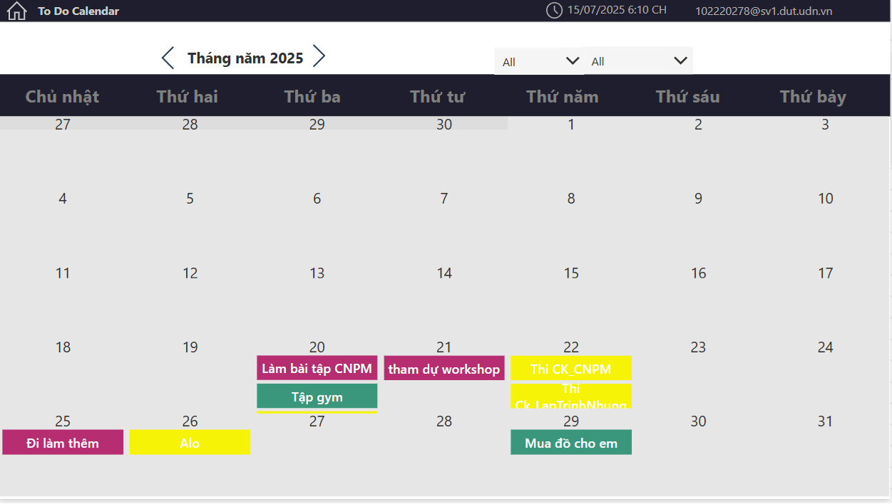
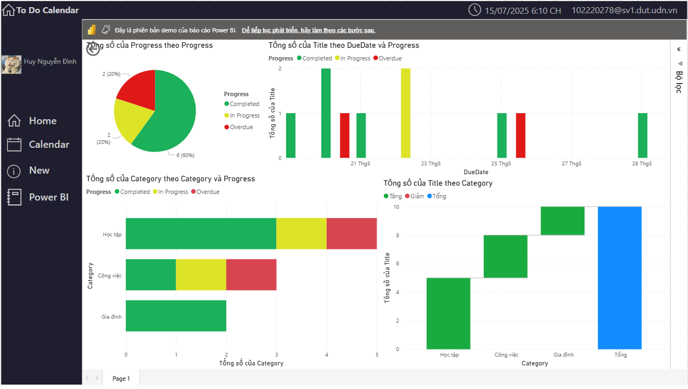
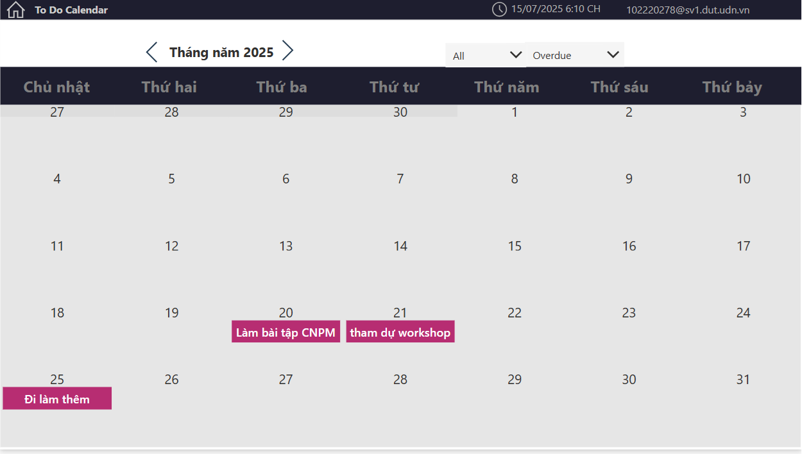
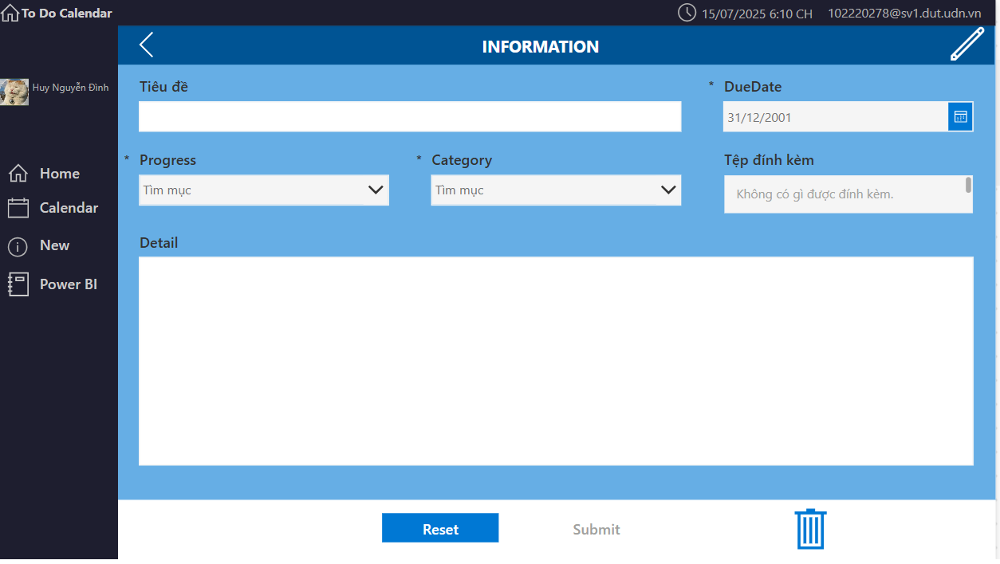

# 🗓️ ToDo Calendar App

A smart and visually intuitive **task manager** built with seamless calendar integration and insightful Power BI dashboards. Designed to help students and professionals track tasks, deadlines, and progress with ease.

---

## 🔍 Overview

**ToDo Calendar** is a personal productivity web application that organizes your tasks into a calendar view, tracks progress, and visualizes your performance via Power BI. Whether you’re a student managing assignments or a worker balancing life and deadlines, this app helps you stay focused and in control.

---

## ✅ Features

### 📌 Task Management
- Add, edit, and delete tasks with categories (e.g., Học tập, Công việc, Gia đình).
- Assign due dates and monitor task **status**: `In Progress`, `Completed`, or `Overdue`.

### 🗓️ Calendar Integration
- View tasks on a monthly calendar.
- Filter tasks by status or category directly on the calendar.
- Color-coded events for quick recognition:
  - 🟩 Completed
  - 🟨 In Progress
  - 🟥 Overdue

### 📊 Power BI Dashboard
- Dynamic charts show progress breakdown.
- Analyze performance by **category**, **status**, and **time**.
- Gain insights and stay on top of your productivity.

### 🔍 Smart Filtering & Detail View
- Search tasks by keyword.
- Click “Detail” for more task information and editing.

### 📝 Task Input Form
- Simple form to add new tasks.
- Dropdowns for **status**, **category**, and calendar-based **date picker**.

---

## 🚀 How to Use

1. **Home**: See all tasks overview.
2. **Calendar**: Visualize tasks by day/month with filtering.
3. **New**: Add new tasks via form.
4. **Power BI**: View visual report of task progress.

> 📅 Ideal for:
> - Students managing coursework and deadlines  
> - Professionals tracking meetings and deliverables  
> - Anyone looking to visualize their productivity

---

## 🛠️ Tech Stack

- **Frontend**: Power Apps
- **Backend/Data**: Microsoft Dataverse
- **Visualization**: Power BI integration
- **Authentication**: Microsoft 365 account-based

---

## 📸 Screenshots

| Home & Overview | Calendar View | Power BI Dashboard |
|-----------------|---------------|---------------------|
|  |  |  |

---

This is a personal project and may be reused or forked for educational purposes.
